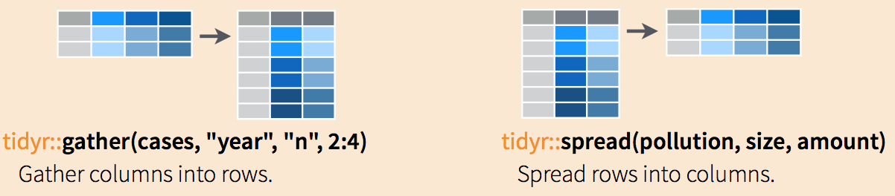

## Required Reading

- This page.

### Guiding Questions

- How can we reshape data into a useable `tidy` form?
- What is a _join_ and why is it a common data wrangling maneuver?
- What is a _primary key_ and why is it important to think about our data in this way?
- How do we deal with messy date variables?


# Introduction to data wrangling

Many of the datasets used in this class have been made available to you as `R` objects, specifically as data frames. The US murders data, the reported heights data, and the Gapminder data were all data frames. Furthermore, much of the data is available in what is referred to as `tidy` form. The tidyverse packages and functions assume that the data is `tidy` and this assumption is a big part of the reason these packages work so well together.

However, very rarely in a data science project is data easily available as part of a package. People did quite a bit of work "behind the scenes" to get the original raw data into the _tidy_ tables. Much more typical is for the data to be in a file, a database, or extracted from a document, including web pages, tweets, or PDFs. In these cases, the first step is to import the data into `R` and, when using the __tidyverse__, tidy up the data. This initial step in the data analysis process usually involves several, often complicated, steps to convert data from its raw form to the _tidy_ form that greatly facilitates the rest of the analysis. We refer to this process as `data wrangling`.

Here we cover several common steps of the data wrangling process including tidying data, string processing, html parsing, working with dates and times, and text mining. Rarely are __all__ these wrangling steps necessary in a single analysis, but data scientists will likely face them all at some point.

# Reshaping data

As we have seen through the class, having data in _tidy_ format is what makes the tidyverse flow. After the first step in the data analysis process, importing data, a common next step is to reshape the data into a form that facilitates the rest of the analysis. The __tidyr__ package includes several functions that are useful for tidying data.

```{r, message=FALSE, warning=FALSE}
library(tidyverse)
library(dslabs)
path <- system.file("extdata", package="dslabs")
filename <- file.path(path, "fertility-two-countries-example.csv")
wide_data <- read_csv(filename)
```


## `gather`

One of the most used functions in the __tidyr__ package is `gather`, which is useful for converting wide data into tidy data.

As with most tidyverse functions, the `gather` function's first argument is the data frame that will be converted. Here we want to reshape the `wide_data` dataset so that each row represents a fertility observation, which implies we need three columns to store the year, country, and the observed value. In its current form, data from different years are in different columns with the year values stored in the column names. Through the second and third argument we will tell `gather` the column names we want to assign to the columns containing the current column names and observations, respectively. In this case a good choice for these two arguments would be `year` and `fertility`. Note that nowhere in the data file does it tell us this is fertility data. Instead, we deciphered this from the file name. Through the fourth argument we specify the columns containing observed values; these are the columns that will be _gathered_. The default is to gather all columns so, in most cases, we have to specify the columns. In our example we want columns `1960`, `1961` up to `2015`.

The code to gather the fertility data therefore looks like this:

```{r}
new_tidy_data <- gather(wide_data, year, fertility, `1960`:`2015`)
```

We can also use the pipe like this:

```{r}
new_tidy_data <- wide_data %>% gather(year, fertility, `1960`:`2015`)
```

We can see that the data have been converted to tidy format with columns `year` and `fertility`:

```{r}
head(new_tidy_data)
```

and that each year resulted in two rows since we have two countries and this column was not gathered.
A somewhat quicker way to write this code is to specify which column will **not** be gathered, rather than all the columns that will be gathered:

```{r}
new_tidy_data <- wide_data %>%
  gather(year, fertility, -country)
```

The `new_tidy_data` object looks like the original `tidy_data` we defined this way

```{r}
data("gapminder")
tidy_data <- gapminder %>%
  dplyr::filter(country %in% c("South Korea", "Germany") & !is.na(fertility)) %>%
  dplyr::select(country, year, fertility)
```

with just one minor difference. Can you spot it? Look at the data type of the year column:

```{r}
class(tidy_data$year)
class(new_tidy_data$year)
```

The `gather` function assumes that column names are characters. So we need a bit more wrangling before we are ready to make a plot. We need to convert the year column to be numbers. The `gather` function includes the `convert` argument for this purpose:

```{r}
new_tidy_data <- wide_data %>%
  gather(year, fertility, -country, convert = TRUE)
class(new_tidy_data$year)
```

Note that we could have also used the `mutate` and `as.numeric`.

Now that the data is tidy, we can use this relatively simple ggplot code:

```{r fertility-year-check, eval=FALSE}
new_tidy_data %>% ggplot(aes(year, fertility, color = country)) +
  geom_point()
```

## `spread`

As we will see in later examples, it is sometimes useful for data wrangling purposes to convert tidy data into wide data. We often use this as an intermediate step in tidying up data. The `spread` function is basically the inverse of `gather`. The first argument is for the data, but since we are using the pipe, we don't show it. The second argument tells `spread` which variable will be used as the column names. The third argument specifies which variable to use to fill out the cells:

```{r}
new_wide_data <- new_tidy_data %>% spread(year, fertility)
dplyr::select(new_wide_data, country, `1960`:`1967`)
```

The following diagram can help remind you how these two functions work:




(Image courtesy of RStudio^[https://github.com/rstudio/cheatsheets]. CC-BY-4.0 license^[https://github.com/rstudio/cheatsheets/blob/master/LICENSE]. Cropped from original.)
<!-- (Source: RStudio. The image is a section of this [cheat sheet](https://github.com/rstudio/cheatsheets/raw/master/data-transformation.pdf).)-->

## `separate` {#separate}

The data wrangling shown above was simple compared to what is usually required. In our example spreadsheet files, we include an illustration that is slightly more complicated. It contains two variables: life expectancy and fertility. However, the way it is stored is not tidy and, as we will explain, not optimal.

```{r, message=FALSE}
path <- system.file("extdata", package = "dslabs")

filename <- "life-expectancy-and-fertility-two-countries-example.csv"
filename <-  file.path(path, filename)

raw_dat <- read_csv(filename)
dplyr::select(raw_dat, 1:5)
```

First, note that the data is in wide format. Second, notice that this table includes values for two variables, fertility and life expectancy, with the column name encoding which column represents which variable. Encoding information in the column names is not recommended but, unfortunately, it is quite common. We will put our wrangling skills to work to extract this information and store it in a tidy fashion.

We can start the data wrangling with the `gather` function, but we should no longer use the column name `year` for the new column since it also contains the variable type. We will call it `key`, the default, for now:

```{r}
dat <- raw_dat %>% gather(key, value, -country)
head(dat)
```

The result is not exactly what we refer to as tidy since each observation (year-country combination) is associated with two, not one, rows. We want to have the values from the two variables, fertility and life expectancy, in two separate columns. The first challenge to achieve this is to separate the `key` column into the year and the variable type. Notice that the entries in this column separate the year from the variable name with an underscore:

```{r}
dat$key[1:5]
```

Encoding multiple variables in a column name is such a common problem that the __tidyverse__ package includes a function to separate these columns into two or more. Apart from the data, the `separate` function takes three arguments: the name of the column to be separated, the names to be used for the new columns, and the character that separates the variables. So, a first attempt at this is:

```{r, eval=FALSE}
dat %>% separate(col = key, into = c("year", "variable_name"), sep = "_")
```


The function does separate the values, but we run into a new problem. We receive the warning `Additional pieces discarded in 112 rows [3, 4, 7,...]`. (Earlier versions may give the error `Too many values at 112 locations:`) and that the `life_expectancy` variable is truncated to `life`. This is because the `_` is used to separate `life` and `expectancy`, not just year and variable name! We could add a third column to catch this and let the `separate` function know which column to _fill in_ with missing values, `NA`, when there is no third value. Here we tell it to fill the column on the right:

```{r}
dat %>% separate(key, into = c("year", "first_variable_name", "second_variable_name"), fill = "right")
```

However, if we read the `separate` help file, we find that a better approach is to merge the last two variables when there is an extra separation:

```{r}
dat %>% separate(key, into = c("year", "variable_name"), extra = "merge")
```

This achieves the separation we wanted. However, we are not done yet. We need to create a column for each variable. As we learned, the `spread` function can do this:

```{r}
dat %>%
  separate(key, c("year", "variable_name"), extra = "merge") %>%
  spread(variable_name, value)
```

The data is now in tidy format with one row for each observation with three variables: year, fertility, and life expectancy.

## `unite`

It is sometimes useful to do the inverse of `separate`, unite two columns into one. To demonstrate how to use `unite`, we show code that, although *not* the optimal approach, serves as an illustration. Suppose that we did not know about `extra` and used this command to separate:

```{r}
dat %>%
  separate(key, c("year", "first_variable_name", "second_variable_name"), fill = "right")
```

We can achieve the same final result by uniting the second and third columns, then spreading the columns and renaming `fertility_NA` to `fertility`:

```{r}
dat %>%
  separate(key, c("year", "first_variable_name", "second_variable_name"), fill = "right") %>%
  unite(variable_name, first_variable_name, second_variable_name) %>%
  spread(variable_name, value) %>%
  rename(fertility = fertility_NA)
```

:::fyi

__TRY IT__

1. Run the following command to define the `co2_wide` object using the `co2` data built in to R (see `?co2`):

```{r, eval=FALSE}
co2_wide <- data.frame(matrix(co2, ncol = 12, byrow = TRUE)) %>%
  setNames(1:12) %>%
  mutate(year = as.character(1959:1997))
```

Use the gather function to wrangle this into a tidy dataset. Call the column with the CO2 measurements `co2` and call the month column `month`. Call the resulting object `co2_tidy`.


2. Plot CO2 versus month with a different curve for each year using this code:

```{r, eval=FALSE}
co2_tidy %>% ggplot(aes(month, co2, color = year)) + geom_line()
```

If the expected plot is not made, it is probably because `co2_tidy$month` is not numeric:

```{r, eval=FALSE}
class(co2_tidy$month)
```


Rewrite the call to gather using an argument that assures the month column will be numeric. Then make the plot.


3. What do we learn from this plot?

a. CO2 measures increase monotonically from 1959 to 1997.
b. CO2 measures are higher in the summer and the yearly average increased from 1959 to 1997.
c. CO2 measures appear constant and random variability explains the differences.
c. CO2 measures do not have a seasonal trend.


4. Now load the `admissions` data set, which contains admission information for men and women across six majors and keep only the admitted percentage column:

```{r, eval=FALSE}
load(admissions)
dat <- admissions %>% dplyr::select(-applicants)
```

If we think of an observation as a major, and that each observation has two variables (men admitted percentage and women admitted percentage) then this is not tidy. Use the `spread` function to wrangle into tidy shape: one row for each major.


5. Now we will try a more advanced wrangling challenge. We want to wrangle the admissions data so that for each major we have 4 observations: `admitted_men`, `admitted_women`, `applicants_men` and `applicants_women`.  The _trick_ we perform here is actually quite common: first gather to generate an intermediate data frame and then spread to obtain the tidy data we want. We will go step by step in this and the next two exercises.

Use the gather function to create a `tmp` data.frame with a column containing the type of observation `admitted` or `applicants`. Call the new columns `key` and value.


6. Now you have an object `tmp` with columns `major`,  `gender`, `key` and  `value`. Note that if you combine the key and gender, we get the column names we want: `admitted_men`, `admitted_women`, `applicants_men` and `applicants_women`. Use the function `unite` to create a new column called `column_name`.

7. Now use the `spread` function to generate the tidy data with four variables for each major.

8. Now use the pipe to write a line of code that turns `admissions` to the table  produced in the previous exercise.

:::

# Joining tables

The information we need for a given analysis may not be just in one table. For example, when forecasting elections we used the function `left_join` to combine the information from two tables. We also saw this in action using the `WDI` function (technically, the `WDI` API) in Project 2. Here we use a simpler example to illustrate the general challenge of combining tables.

Suppose we want to explore the relationship between population size for US states and electoral votes. We have the population size in this table:

```{r, warning=FALSE, message=FALSE}
library(tidyverse)
library(dslabs)
data(murders)
head(murders)
```

and electoral votes in this one:

```{r}
data(polls_us_election_2016)
head(results_us_election_2016)
```

Just concatenating these two tables together will not work since the order of the states is not the same.

```{r}
identical(results_us_election_2016$state, murders$state)
```

The _join_ functions, described below, are designed to handle this challenge.

## Joins {#joins}

The _join_ functions in the __dplyr__ package (part of the tidyverse) make sure that the tables are combined so that matching rows are together. If you know SQL, you will see that the approach and syntax is very similar. The general idea is that one needs to identify one or more columns that will serve to match the two tables. Then a new table with the combined information is returned. Notice what happens if we join the two tables above by state using `left_join` (we will remove the `others` column and rename `electoral_votes` so that the tables fit on the page):

```{r}
tab <- left_join(murders, results_us_election_2016, by = "state") %>%
  dplyr::select(-others) %>% 
  rename(ev = electoral_votes)
head(tab)
```

The data has been successfully joined and we can now, for example, make a plot to explore the relationship:

```{r ev-vs-population, message=FALSE, warning=FALSE}
library(ggrepel)
tab %>% ggplot(aes(population/10^6, ev, label = abb)) +
  geom_point() +
  geom_text_repel() +
  scale_x_continuous(trans = "log2") +
  scale_y_continuous(trans = "log2") +
  geom_smooth(method = "lm", se = FALSE)
```

We see the relationship is close to linear with about 2 electoral votes for every million persons, but with very small states getting higher ratios.


In practice, it is not always the case that each row in one table has a matching row in the other. For this reason, we have several versions of join. To illustrate this challenge, we will take subsets of the tables above. We create the tables `tab1` and `tab2` so that they have some states in common but not all:

```{r}
tab_1 <- slice(murders, 1:6) %>% dplyr::select(state, population)
tab_1
tab_2 <- results_us_election_2016 %>%
  dplyr::filter(state%in%c("Alabama", "Alaska", "Arizona",
                    "California", "Connecticut", "Delaware")) %>%
  dplyr::select(state, electoral_votes) %>% rename(ev = electoral_votes)
tab_2
```


We will use these two tables as examples in the next sections.

### Left join

Suppose we want a table like `tab_1`, but adding electoral votes to whatever states we have available. For this, we use `left_join` with `tab_1` as the first argument. We specify which column to use to match with the `by` argument.

```{r}
left_join(tab_1, tab_2, by = "state")
```

Note that `NA`s are added to the two states not appearing in `tab_2`. Also, notice that this function, as well as all the other joins, can receive the first arguments through the pipe:

```{r, eval=FALSE}
tab_1 %>% left_join(tab_2, by = "state")
```


### Right join

If instead of a table with the same rows as first table, we want one with the same rows as second table, we can use `right_join`:

```{r}
tab_1 %>% right_join(tab_2, by = "state")
```

Now the NAs are in the column coming from `tab_1`.

### Inner join

If we want to keep only the rows that have information in both tables, we use `inner_join`. You can think of this as an intersection:

```{r}
inner_join(tab_1, tab_2, by = "state")
```

### Full join

If we want to keep all the rows and fill the missing parts with NAs, we can use `full_join`. You can think of this as a union:

```{r}
full_join(tab_1, tab_2, by = "state")
```

### Semi join

The `semi_join` function lets us keep the part of first table for which we have information in the second. It does not add the columns of the second. It isn't often used:

```{r}
semi_join(tab_1, tab_2, by = "state")
```
This gives the same result as:
```{r}
tab_1 %>% 
  filter(state %in% tab_2$state) 
```

### Anti join

The function `anti_join` is the opposite of `semi_join`. It keeps the elements of the first table for which there is no information in the second:

```{r}
anti_join(tab_1, tab_2, by = "state")
```

The following diagram summarizes the above joins:


(Image courtesy of RStudio^[https://github.com/rstudio/cheatsheets]. CC-BY-4.0 license^[https://github.com/rstudio/cheatsheets/blob/master/LICENSE]. Cropped from original.)

## Binding

Although we have yet to use it in this book, another common way in which datasets are combined is by _binding_ them. Unlike the join function, the binding functions do not try to match by a variable, but instead simply combine datasets. If the datasets don't match by the appropriate dimensions, one obtains an error.

### Binding columns

The __dplyr__ function _bind_cols_ binds two objects by making them columns in a tibble. For example, we quickly want to make a data frame consisting of numbers we can use.

```{r}
bind_cols(a = 1:3, b = 4:6)
```

This function requires that we assign names to the columns. Here we chose `a` and `b`.

Note that there is an R-base function `cbind` with the exact same functionality. An important difference is that `cbind` can create different types of objects, while `bind_cols` always produces a data frame.

`bind_cols` can also bind two different data frames. For example, here we break up the `tab` data frame and then bind them back together:

```{r}
tab_1 <- tab[, 1:3]
tab_2 <- tab[, 4:6]
tab_3 <- tab[, 7:8]
new_tab <- bind_cols(tab_1, tab_2, tab_3)
head(new_tab)
```


### Binding by rows

The `bind_rows` function is similar to `bind_cols`, but binds rows instead of columns:

```{r}
tab_1 <- tab[1:2,]
tab_2 <- tab[3:4,]
bind_rows(tab_1, tab_2)
```

This is based on an R-base function `rbind`.

## Set operators

Another set of commands useful for combining datasets are the set operators. When applied to vectors, these behave as their names suggest. Examples are `intersect`, `union`, `setdiff`, and `setequal`. However, if the __tidyverse__, or  more specifically __dplyr__, is loaded, these functions can be used on data frames as opposed to just on vectors.

### Intersect

You can take intersections of vectors of any type, such as numeric:

```{r}
intersect(1:10, 6:15)
```
or characters:

```{r}
intersect(c("a","b","c"), c("b","c","d"))
```

The __dplyr__ package includes an `intersect` function that can be applied to tables with the same column names. This function returns the rows in common between two tables. To make sure we use the __dplyr__ version of `intersect` rather than the base package version, we can use `dplyr::intersect` like this:


```{r}
tab_1 <- tab[1:5,]
tab_2 <- tab[3:7,]
dplyr::intersect(tab_1, tab_2)
```


### Union

Similarly _union_ takes the union of vectors. For example:

```{r}
union(1:10, 6:15)
union(c("a","b","c"), c("b","c","d"))
```

The __dplyr__ package includes a version of `union` that combines all the rows of two tables with the same column names.

```{r}
tab_1 <- tab[1:5,]
tab_2 <- tab[3:7,]
dplyr::union(tab_1, tab_2)
```
Note that we get 7 unique rows from this. We do not get duplicated rows from the overlap in `1:5` and `3:7`. If we were to `bind_rows` on the two subsets, we would get duplicates.

### `setdiff`

The set difference between a first and second argument can be obtained with `setdiff`. Unlike `intersect` and `union`, this function is not symmetric:


```{r}
setdiff(1:10, 6:15)
setdiff(6:15, 1:10)
```

As with the functions shown above, __dplyr__ has a version for data frames:

```{r}
tab_1 <- tab[1:5,]
tab_2 <- tab[3:7,]
dplyr::setdiff(tab_1, tab_2)
```

### `setequal`

Finally, the function `setequal` tells us if two sets are the same, regardless of order. So notice that:

```{r}
setequal(1:5, 1:6)
```

but:

```{r}
setequal(1:5, 5:1)
```

When applied to data frames that are not equal, regardless of order, the __dplyr__ version provides a useful message letting us know how the sets are different:

```{r}
dplyr::setequal(tab_1, tab_2)
```


:::fyi

__TRY IT__

1. Install and load the __Lahman__ library. This database includes data related to baseball teams. It includes summary statistics about how the players performed on offense and defense for several years. It also includes personal information about the players.

The `Batting` data frame contains the offensive statistics for all players for many years. You can see, for example, the top 10 hitters by running this code:

```{r, eval=FALSE}
library(Lahman)

top <- Batting %>%
  dplyr::filter(yearID == 2016) %>%
  arrange(desc(HR)) %>%
  slice(1:10)

top %>% as_tibble()
```

But who are these players? We see an ID, but not the names. The player names are in this table

```{r, eval=FALSE}
Master %>% as_tibble()
```

We can see column names `nameFirst` and `nameLast`. Use the `left_join` function to create a table of the top home run hitters. The table should have `playerID`, first name, last name, and number of home runs (HR).  Rewrite the object `top` with this new table.


2. Now use the `Salaries` data frame to add each player's salary to the table you created in exercise 1. Note that salaries are different every year so make sure to filter for the year 2016, then use `right_join`. This time show first name, last name, team, HR, and salary.


3. In a previous exercise, we created a tidy version of the `co2` dataset:


```{r, eval=FALSE}
co2_wide <- data.frame(matrix(co2, ncol = 12, byrow = TRUE)) %>%
  setNames(1:12) %>%
  mutate(year = 1959:1997) %>%
  gather(month, co2, -year, convert = TRUE)
```

We want to see if the monthly trend is changing so we are going to remove the year effects and then plot the results. We will first compute the year averages. Use the `group_by` and `summarize` to compute the average co2 for each year. Save in an object called `yearly_avg`.


4. Now use the `left_join` function to add the yearly average to the `co2_wide` dataset. Then compute the residuals: observed co2 measure - yearly average.


5. Make a plot of the seasonal trends by year but only after removing the year effect.

:::


## A note about merging and duplicated rows

When we merge data, we have to be very careful about duplicated rows. Specifically, we have to be certain that the fields we use to join on are unique **or** that we know they aren't unique and intend to duplicate rows.

When we have tidy data, we have one row per observation. When we join data that has more than one row per observation, the new dataset will no longer be tidy. For instance:

```{r}
tidyData <- bind_cols( state = c('MI','CA','MI','CA'), 
                       year = c(2001, 2002, 2001, 2002),  
                       Arrests = c(10, 21, 30, 12))

notTidyData <- bind_cols(state = c('MI','MI','MI','CA','CA','CA'), 
                         County = c('Ingham','Clinton','Wayne','Orange','Los Angeles','Kern'),
                         InNOut_locations = c(0,0,0,20, 31, 8))

head(tidyData)
head(notTidyData)
```

If we use the only common field, `state` to merge `tidyData`, which is unique on `state` and `year`, to `notTidyData`, which is unique on `county`, then every time we see `state` in our "left" data, we will get **all three counties in that state and for that year**. Even worse, we will get the `InNOut_locations` tally repeated for every matching `state`!

```{r}
joinedData <- left_join(tidyData, notTidyData, by = c('state'))
joinedData
```

Because we asked for all columns of `tidyData` that matched (on `state`) in `notTidyData`, we get replicated `Arrests` - look at MI in 2001 in the first three rows. The original data had 10 Arrests in Michigan in 2001. Now, *for every MI County in `notTidyData`, we have replicated the statewide arrests!*

```{r}
sum(joinedData$Arrests)
sum(tidyData$Arrests)
```

Yikes! We now have 3x the number of arrests in our data. 

```{r}
sum(joinedData$InNOut_locations)
sum(notTidyData$InNOut_locations)
```

And while we might like that we have 3x the In-N-Out locations, we definitely think our data shouldn't suddenly have more.

The reason this happens is that we do not have a unique *key* variable. In the `WDI` tip in Project 2, we didn't have a single unique key variable - there were multiple values of `iso2` country code in the data because we had multiple years for each `iso2`. Thus, when we merged, use used `by = c('iso2','year')` because **the `iso2` x `year` combination was the unique key**.

The lesson is this: always know what your join is doing. Know your unique keys. Use `sum(duplicated(tidyData$key))` to see if all values are unique, or `NROW(unique(tidyData %>% dplyr::select(key1, key2)))` to see if all rows are unique over the 2 keys (replacing "key1" and "key2" with your key fields).

If it shouldn't add rows, then make sure the new data has the same number of rows as the old one, or use `setequal` to check. 


# Parsing dates and times

## The date data type

We have described three main types of vectors: numeric, character, and logical. In data science projects, we very often encounter variables that are dates. Although we can represent a date with a string, for example `November 2, 2017`, once we pick a reference day, referred to as the _epoch_, they can be converted to numbers by calculating the number of days since the epoch. Computer languages usually use January 1, 1970, as the epoch. So, for example, January 2, 2017 is day 1, December 31, 1969 is day -1, and November 2, 2017, is day 17,204.

Now how should we represent dates and times when analyzing data in R? We could just use days since the epoch, but then it is almost impossible to interpret. If I tell you it's November 2, 2017, you know what this means immediately. If I tell you it's day 17,204, you will be quite confused. Similar problems arise with times and even more complications can appear due to time zones.

For this reason, `R` defines a data type just for dates and times. We saw an example in the polls data:

```{r,  message=FALSE, warning=FALSE}
library(tidyverse)
library(dslabs)
data("polls_us_election_2016")
polls_us_election_2016$startdate %>% head
```

These look like strings, but they are not:

```{r}
class(polls_us_election_2016$startdate)
```

Look at what happens when we convert them to numbers:

```{r}
as.numeric(polls_us_election_2016$startdate) %>% head
```

It turns them into days since the epoch. The `as.Date` function can convert a character into a date. So to see that the epoch is day 0 we can type

```{r}
as.Date("1970-01-01") %>% as.numeric
```

Plotting functions, such as those in ggplot, are aware of the date format. This means that, for example, a scatterplot can use the numeric representation to decide on the position of the point, but include the string in the labels:

```{r rawpolls-vs-time}
polls_us_election_2016 %>% dplyr::filter(pollster == "Ipsos" & state =="U.S.") %>%
  ggplot(aes(startdate, rawpoll_trump)) +
  geom_line()
```

Note in particular that the month names are displayed, a very convenient feature.

## The lubridate package {#lubridate}

The __tidyverse__ includes functionality for dealing with dates through the __lubridate__ package.

```{r, warning=FALSE, message=FALSE}
library(lubridate)
```

We will take a random sample of dates to show some of the useful things one can do:

```{r}
set.seed(2002)
dates <- sample(polls_us_election_2016$startdate, 10) %>% sort
dates
```

The functions `year`, `month` and `day` extract those values:

```{r}
tibble(date = dates,
       month = month(dates),
       day = day(dates),
       year = year(dates))
```

We can also extract the month labels:

```{r}
month(dates, label = TRUE)
```


Another useful set of functions are the _parsers_ that convert strings into dates. The function `ymd` assumes the dates are in the format YYYY-MM-DD and tries to parse as well as possible.

```{r}
x <- c(20090101, "2009-01-02", "2009 01 03", "2009-1-4",
       "2009-1, 5", "Created on 2009 1 6", "200901 !!! 07")
ymd(x)
```

A further complication comes from the fact that dates often come in different formats in which the order of year, month, and day are different. The preferred format is to show year (with all four digits), month (two digits), and then day, or what is called the ISO 8601. Specifically we use YYYY-MM-DD so that if we order the string, it will be ordered by date. You can see the function `ymd` returns them in this format.

But, what if you encounter dates such as "09/01/02"? This could be September 1, 2002 or January 2, 2009 or January 9, 2002.
In these cases, examining the entire vector of dates will help you determine what format it is by process of elimination. Once you know, you can use the many parses provided by __lubridate__.

For example, if the string is:

```{r}
x <- "09/01/02"
```

The `ymd` function assumes the first entry is the year, the second is the month, and the third is the day, so it converts it to:

```{r}
ymd(x)
```

The `mdy` function assumes the first entry is the month, then the day, then the year:

```{r}
mdy(x)
```

The _lubridate_ package provides a function for every possibility:
```{r}
ydm(x)
myd(x)
dmy(x)
dym(x)
```

The __lubridate__ package is also useful for dealing with times. In R base, you can get the current time typing `Sys.time()`. The __lubridate__ package provides a slightly more advanced function, `now`, that permits you to define the time zone:

```{r}
now()
now("GMT")
```

You can see all the available time zones with `OlsonNames()` function.

We can also extract hours, minutes, and seconds:

```{r}
now() %>% hour()
now() %>% minute()
now() %>% second()
```

The package also includes a function to parse strings into times as well as parsers for time objects that include dates:


```{r}
x <- c("12:34:56")
hms(x)
x <- "Nov/2/2012 12:34:56"
mdy_hms(x)
```

This package has many other useful functions. We describe two of these here that we find particularly useful.

The `make_date` function can be used to quickly create a date object. It takes three arguments: year, month, day, hour, minute, seconds, and time zone defaulting to the epoch values on UTC time. So create an date object representing, for example, July 6, 2019 we write:

```{r}
make_date(2019, 7, 6)
```

To make a vector of January 1 for the 80s we write:

```{r}
make_date(1980:1989)
```

Another very useful function is the `round_date`. It can be used to _round_ dates to nearest year, quarter,  month, week, day, hour, minutes, or seconds. So if we want to group all the polls by week of the year we can do the following:

```{r poll-margin-versus-week}
polls_us_election_2016 %>%
  mutate(week = round_date(startdate, "week")) %>%
  group_by(week) %>%
  summarize(margin = mean(rawpoll_clinton - rawpoll_trump)) %>%
  qplot(week, margin, data = .)
```

Date objects can be added to and subtracted from with `hours`, `minutes`, etc.

```{r}
startDate <- ymd_hms('2021-06-14 12:20:57')

startDate + seconds(4)

startDate + hours(1) + days(2) - seconds(10)

```

You can even calculate time differences in specific units:

```{r}
endDate = ymd_hms('2021-06-15 01:00:00')

endDate - startDate

difftime(endDate, startDate, units = 'days')

```

Note that both of these result in a `difftime` object. You can use `as.numeric(difftime(endDate, startDate))` to get the numeric difference in times.

Sequences can be created as well:

```{r}
seq(from = startDate, to = endDate, by = 'hour')

```


### Code for In-Class Discussion (Airbnb Data)

Airbnb datasets contain listings of rental properties in various cities and are known for having messy data. You can download the data for a city of your choice from Inside Airbnb. Link [here](http://insideairbnb.com/get-the-data/). 

Here are the tasks to perform to start. We'll do more of this on Thursday. 

1. Load the data
2. Clean and format variables
3. Filter and sort data
4. Calculate new variables

The code below is not complete and may not work as intended. But it may give you somewhere to start. 


```{r, eval = FALSE, echo=TRUE}
# Load necessary packages
library(tidyverse)
library(lubridate)

# 1. Load the data
listings <- read_csv("listings.csv")

# 2. Clean and format variables
listings_clean <- listings %>%
  mutate(price = parse_number(price),
         cleaning_fee = parse_number(cleaning_fee, na = "0"),
         host_since = ymd(host_since),
         host_duration = as.numeric(difftime(today(), host_since, units = "days")) / 365
  )

# 3. Filter and sort data
listings_filtered <- listings_clean %>%
  filter(room_type == "Entire home/apt",
         accommodates >= 2,
         bedrooms >= 1,
         bathrooms >= 1
  ) %>%
  arrange(desc(review_scores_rating))

# 4. Calculate new variables
listings_summary <- listings_filtered %>%
  group_by(neighbourhood) %>%
  summarize(count = n(),
            avg_price = mean(price, na.rm = TRUE),
            avg_rating = mean(review_scores_rating, na.rm = TRUE)
  ) %>%
  arrange(desc(count))
```


