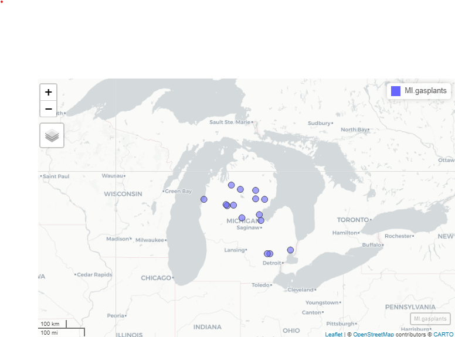

## Required Reading

- This page.

### Guiding Questions

- What are the building blocks of geospatial data?
- How do we handle uniquely geospatial properties like distance or spatial correlation?


# Geospatial in R

We will need a handful of new packages for our introduction to geospatial analysis in R. The primary package we will interact with is the `sf` package. `sf` stands for "simple features." It has become the standard for geospatial work in R, and relies on the `rgeos` and `rgdal` libraries (which are themselves `R` compilations of the `geos` and `gdal` libraries). Documentation of sf [can be found here](https://r-spatial.github.io/sf/). 

We will also use the `mapview` package, as well as the `tmaptools` package. Plus, we'll use `tigris` to get state boundaries and `tidycensus` to pull down census maps. Install those, and any of the many dependencies that they also install.


```{r, echo=TRUE, message = F, warning = F}
library(sf)
library(mapview)
library(tigris)
library(tidycensus)
library(tidyverse)
library(tmaptools)
```


## Vector vs. Raster
There are two ways of storing 2-D mapped spatial data, *raster* and *vector*. A *vector* representation of a 2-D shape is best described as an irregular polygon with points defining vertices. A square plotted in cartesian coordinates is a vector representation. Conversely, a *raster* image is a grid of cells where each cell is defined as "in" or "out" of the square. Most computer graphics like JPEG and TIFF are raster graphics and each pixel has an assigned color. To make a raster image of a blue square, we'd make a big grid of pixels, and then color some blue based on their location. To make a blue square in vector form, we'd record *just the location of the corners* and add instructions to color inside the polygon formed by those corners blue.

```{r, out.width = '50%', echo = F}
knitr::include_graphics('https://vector-conversions.com/images/vector_vs_raster.jpg')
```

### Vectors are scalable. Rasters are not
Rasters are great for detail, like pixels in a picture, but they do not scale up very well. Vectors are great for things that do need to scale up. They are also smaller and easier to work with when they aren't trying to replicate photo-realistic images.  Vectors can handle curves by recording the properties of the curve (e.g. bezier curves), while rasters have to approximate curves along the grid of cells, so if you want a smooth curve, you need lots of cells.

Geospatial work is almost always done in vectors because (1) it is easier to store data as vectors, and (2) it is easier to manipulate, project, intersect, or connect vector points, lines, and polygons.

We are going to work entirely with vectors today.


# Vectors: points, lines, and polygons
Most everything we would want to map can be represented as a point, a line, or a polygon. Points could be the location of power plants in the US, or the location of COVID cases, or the location of major intersections. Lines could be the location of train tracks, the shortest distance between someone's house and the nearest restaurants, or a major road. Polygons could be county boundaries, landowner's lot lines, or bodies of water.

We can start by making some points, then turning them into a polygon. We'll just use arbitrary coordinates for now, but will move into GPS latitude-longitude coordinates shortly. We'll use `st_multipoint` to create our points object. It takes a numeric matrix only.

```{r, echo = TRUE}
myPoints = tribble(~X, ~Y,
                   0, 0,
                   0, 4,
                   1, 4,
                   1, 1,
                   .5, 0,
                   0, 0)

myPoints = st_multipoint(as.matrix(myPoints))
plot(myPoints)

```

### Making polygons
We've begun making our first spatial object! Now, we can turn it into a polygon under one condition: the polygon has to "close" in order for R to know which side is the inside. In `myPoints`, the *last* point is identical to the *first* point, so R will "close" it:

```{r, echo = TRUE}
plot(st_polygon(list(myPoints)), col = 'darkgreen')
```


That's just one polylgon. Let's add another one. When we created the polygon, we put the points object, `myPoints`, into a list. If we have a list of, say, two points objects, then we'll get two polygons:

```{r}
myPoints2 = tribble(~X, ~Y,
                    1,1,
                    2,1,
                    2,2,
                    1,2,
                    1,1)
                    
myPoints2 = st_multipoint(as.matrix(myPoints2))

myPolygons = st_polygon(list(myPoints, myPoints2))
plot(myPolygons, col = 'lightblue')
```


Now we can see two polygons. Looking at the `str`ucture of the polygons:

```{r}
str(myPolygons)
```

Notice that one of the classes is `sfg`. This is a `sf` package-defined spatial object. 

### Getting points on a plot
One little-known trick in R is super helpful in spatial work. If you `plot(myPolygons)` in your own R-studio console (so it appears in your "Plots" pane, not knit into your document), you can use `click(n)` to interactively get $n$ spatial points in the coordinate system of your plot. 

```{r, echo = T, eval = F}
myClicks = click(n = 3)
myClicks = rbind(myClicks, myClicks[1,])  # copy the first point to the last point to "close"
myNewPolygon = st_polygon(list(st_multipoint(myClicks)))
plot(myPolygons, col = 'lightblue')
plot(myNewPolygon, col = 'green', add=T)

```


```{r, echo = F, eval = T}
myClicks = as.matrix(data.frame(x = c(.37, 1.06, 1.31),
                                y = c(2.71, .47, 2.66)))
                     
myClicks = rbind(myClicks, myClicks[1,])  # copy the first point to the last point to "close"
myNewPolygon = st_polygon(list(st_multipoint(myClicks)))
plot(myPolygons, col = 'lightblue')
plot(myNewPolygon, col = 'green', add=T)

```

### Making lines

We could also create a line with our points. I'll leave off the one point we added to "close" the polygon. Note that the line is colored blue, not the (uncompleted) polygon.

```{r}
myLine = st_linestring(myPoints[1:4,])
plot(myLine, col = 'blue')

```

# Reading spatial data
While it's fun to draw our own shapes (caution: my definition of fun $\neq$ your definition of fun), we're probably most interested in finding and using existing spatial data. Let's talk briefly about the types of spatial data out there:

- Shapefiles
  - Shapefiles are not actually single files - they're usually 4-6 files with similar names and different suffixes like .dbf, .shx, etc. This is because the shapefile format kind of pre-dates our current way of thinking of file storage. The most common program for reading or making shapefiles is ESRI's ArcGIS. It is expensive, cumbersome, and some may say bloated. Our goal in this section is to be able to rescue shapefiles from the clutches of ArcGIS and open them in R
  
- GEOJSON
  - JSON is a way of structuring text data (like a .csv) but with the potential for nests in the data (like our `list` object) where each nest has a different data structure. GEOJSON pairs this with **WKT** or Well-Known Text representations of coordinates and takes care of making sure that each observation in the JSON data has a corresponding polygon in WKT coordinates.
  
- KML
  - Bare-bones storage of coordinates and basic data
  
- .RDS
  - Okay, this is just R's native data type for storage, but it's really helpful for storing `sf` objects
  
- Comma separated values (.csv)
  - Just like the CSV's we've been using, but with Latitude and Longitude columns. Only works for points (one point per .csv line), but is very commonly found. We can use `st_as_sf` to tell R which columns are the latitude and longitude.

We can open and use any one of these filetypes. I will cover Shapefiles and GEOJSON as the latter has become a very popular way of sharing spatial datasets.

### Where to find spatial data
Spatial data is all around us! Try searching google for a topic + "spatial shapefile". One of my favorite sources for spatial data is the DHS [HIFLD Open database](https://hifld-geoplatform.opendata.arcgis.com/), which has lots of government datasets that are well-organized by category. Click through, and when you find something you like, click the "Download" button. If there is a GEOJSON or KML file available, **right-click** and copy the link address. Then, use that with `st_read()`. On many maps (including this one), the GeoJSON link is shown under the API drop-down. Use GeoJSON over KML as some systems have issues importing the data fields in KML. 

### Loading the data
We'll use the `sf` package's `st_read` to open spatial data. Here, I'm loading the Natural Gas Processing Plants data from the Energy section of HIFLD. I'm using the **GeoJSON** option, which `st_read()` knows how to handle:

```{r}
gasplants = st_read('https://opendata.arcgis.com/datasets/ca984888f8154c63bf3a023f0a1f9ac2_0.geojson') %>%
  dplyr::select(name = NAME)

head(gasplants)
```

The `sf` data type holds both the data (which here is just the name of the plant) *and* the "geometry", which are the points. It's tidy data - one row is one observation of one plant, and each row has a set of coordinates telling us where to find the plant.

We can use ggplot with `geom_sf()` to plot these points. They're just scattered across the country and we don't automatically get a background map, but here are the points 
```{r}
ggplot(gasplants) + geom_sf() + theme_minimal()
```

Well, we're missing some context here -- we can kind of make out the point of Texas down there, but it's hard to tell anything about where these plants are located. Let's use `tidycensus` to get a map of the US, then plot it plus the points. Note we use different `data = ` in each of the `geom_sf()` calls:

```{r, message = F, warning = F, results = 'hide'}

US <- states(cb = TRUE, progress_bar = FALSE)  # tidycensus maps

ggplot() + geom_sf(data = US, col = 'gray50') +
  geom_sf(data = gasplants) + theme_minimal()

```


Getting there. The problem now is that the `tigris` data covers all US territories, which are really spread out! Let's drop down to just Michigan. We can use good old `filter` just like with regular data:

```{r}
MI = states(cb = TRUE) %>% dplyr::filter(STUSPS=='MI')

ggplot() + geom_sf(data = MI, col = 'gray50') +
  geom_sf(data = gasplants) + theme_minimal()


```

Well, now we have a different problem. We want to have only the `gasplants` that are `over` the state of Michigan. That requires a **spatial join**. Luckily, our `tidyverse` syntax **works pretty seamlessly on `sf` objects**. First, we have to take care of a little issue with spatial data. The **projection**

### Projections, briefly
The *projection* for spatial data is the translation from a 3-D object (e.g. the globe) to a 2-D space (a map, or the cartesian x-y coordinates of our screen). This is no simple matter! There are entire PhD programs dedicated to forming and processing projections and datum (which refer to the shape of the globe, which is not actually round). It can all be a nightmare. Worst of all, projections determine the definition of your coordinates, so you may be at -81 latitude, +30 longitude, but in another projection, you might be 1245349m above some reference point, and -2452849m to the left of that point. Projections define the distance along the X and Y axis, the scale of the coordinates, and a lot of other stuff about your 2-D polygons.

Luckily, over the last few years, very smart people have been working on regularizing "projections". Now, we really need to know three things:

1. The *projection* of your data's coordinates when you read it in
2. The *projection* you want your data to be in when you map it
3. The *projection* of other spatial data you may want to combine.

#### Importing projected data
GEOJSON, shapefiles, and KML files usually come with embedded projections stored as **EPSG** numbers like '4326' (incidentally, '4326' is the usual projection for GPS coordinates). Thus, the first one is usually already taken care of. If your data doesnt have a PROJ4 or EPSG number but the coordinates are all between -180 and +180, it's likely in EPSG=4326. If none of those, then the data creator should have *metadata* stating the proejction. It might take some googling and some trial and error.

For mapping, you might need to *transform* your data between projections (or "reproject" it, same thing). We use `st_transform` for this. We only need to give `R` the EPSG (Geodetic Parameter Dataset) of the projection you want to end up in. As long as it's already in a known projection, `R` can re-project it. The projection is refered to by the Coordinate Reference System (CRS). `st_crs` will tell us the projection (EPSG number and a lot more) of any spatial object. If they do not match, then `R` will give an error or, worse, plot them on totally different scales - sometimes you end up with points from the US landing in the middle of the Indian Ocean! In fact, look back at our map of gas plants and the US. 

::: Notice
Did you notice that a lot of the US gas plants mapped to...Canada? Those might be Alaskan plants, but the *projections* were not identical, so the definition of coordinates were different between our US map and our gas plants maps. Neither is "right" or "wrong" - they just have to be the same. Differences in projections tend to be worse at the extreme latitudes.
:::

```{r}
st_crs(gasplants)
st_crs(MI)
```
One is in 4326, the other in 4269. We can use `st_transform` on the `gasplants` data, which will reproject the points (and won't change the data at all). The data won't be any different, and the points won't look too much different

```{r}
gasplants = gasplants %>%
  st_transform(st_crs(MI))

ggplot(gasplants) + geom_sf() + theme_minimal()
```

#### Importing unprojected data
Sometimes, we have data only in .csv format, but with X and Y coordinates (e.g. Longitude and Latitude). To import this data, we do the following:

- Read in from .csv, .xls, etc.
- Determine the CRS of the data (usually 4326 for gps coordinates)
- Set the spatial coordinates and CRS


We know how to do the first, and the 2nd and 3rd are done in one step. We'll make a data.frame of city names and use the `tmaptools` package's `geocode_OSM` to get the latitudes and longitudes of the city centers. This function uses open-source Open Street Maps instead of the google API (which is used by `ggmap`). This way, we don't need an API key.

```{r}

ourCities = geocode_OSM(c('Detroit','Lansing','Grand Rapids','Kalamazoo','Traverse City','Marquette')) %>%
  select(City = query, lat = lat, lon = lon)

head(ourCities)
```

Since these are GPS-type coordinates, we are going to assume the CRS is EPSG=4326. Longitude is the "x" axis, and latitude is the "y" axis.

```{r}
ourCities.spatial = st_as_sf(ourCities, coords = c('lon','lat'), crs = 4326)
head(ourCities.spatial)
```

Now we have the point geometries! We can map this:

```{r}
ggplot() +
  geom_sf(data = MI, fill = 'gray90') +
  geom_sf(data = ourCities.spatial, col = 'blue') +
  theme_minimal()
```

## Spatial merges
Combining spatial data is the strength of geospatial analysis. We have our map of MI, and we have out points. Let's "merge" the points to the map, meaning let's connect the elements in our map (the state of MI) to the elements in our points (gas plants). This is a point-to-polygon merge.

### Point-to-polygon merges
We'll use `st_join` to produce an inner join, so we keep only those points that are "in" (spatially) the state of Michigan. I'm specifying `join = st_intersects` though this is the default. Note that all the points that remain in the merged `MI.gasplants` are in Michigan, and note that all the data columns from `MI` are now in `gasplants`. We'll use a county map of MI here so we will have the *county* data for each county containing a gas plant.

```{r, warning = F, message = F, result = 'hide'}

MI.counties = counties(state = 'MI', cb = TRUE, progress_bar = FALSE)

MI.gasplants = gasplants %>%
  st_transform(st_crs(MI.counties)) %>%
  st_join(MI.counties, left = FALSE,
          join = st_intersects)

head(MI.gasplants)
```


Now, we can plot the counties map with the gasplants over it. We can even use `aes(...)` to `fill` the counties:

```{r}
ggplot() + 
  geom_sf(data = MI.counties, aes(fill = NAME), show.legend = F) +  
  geom_sf(data = MI.gasplants) + 
  theme_minimal()  
```

Huh. Most gas plants in Michigan are to the north of here. Interesting.

### Mapview
Sometimes, we want to be able to zoom in and out. `ggplot` is static, so that won't work too well. Thanks to the `leaflet` engine, the `mapview` packages is stellar for exploration of spatial data. You can specify `zcol = Name` if you want to color by the `Name` field. I can't embed this in the website, but you can run this at home. It will appear in the "Viewer" pane, not in the "Plots" pane. Unlike the static image here, you will be able to zoom and pan.

```
mapview(MI.gasplants)
```

```{r, echo = F, warning=F, message = F}

```

In an actual mapview window (not this static image here), clicking on the points or polygons will bring up a pop-up of the data for that row. Mapview is very useful for exploring your spatial data.

### Polygon-to-polygon merges
The gas plants and state merge, above, was very simple because points are always either within or not within a polygon. Worst that can happen is some of your points are not over any polygon at all (resulting in `NA` values). But what if you're merging polygons to polygons?

First, let's load some (overlapping) polygons. We can load up all of our states again (dropping the territories). We'll also use a map of watersheds (which cross state boundaries). This is the HUC-4 map of the Rockies from the [US Geological Survey](https://hub.arcgis.com/datasets/7f8632f3e3114623b4f5c8f97d935dca_1?geometry=-157.095%2C32.305%2C-73.379%2C44.324). The HUC-4 is a definition of a watershed where the area of the HUC-4 is the area drained by a major tributary:

```{r, message =F, warning=F}
US = states(cb=TRUE) %>%
  dplyr::filter(!STUSPS %in% c('PR','GU','VI','MP','AS','AK','HI'))

HUC4 = st_read('https://opendata.arcgis.com/datasets/7f8632f3e3114623b4f5c8f97d935dca_1.kml') %>%
  st_transform(st_crs(US)) %>%
  dplyr::mutate(randomData = rpois(n(), 20))

ggplot() + 
  geom_sf(data = US, col = 'gray50') +
  geom_sf(data = HUC4, aes(fill = Name), show.legend = FALSE) + 
  theme_minimal()


```

These watersheds clearly overlap state boundaries. So what happens if we merge them? `sf` will create a new obsveration (row) for every HUC-4 / State combination

```{r, message = F, warning = F}
poly.merge = HUC4 %>%
  st_join(US, left = TRUE)

head(poly.merge)
```

Now, every HUC-4 like "Lower Colorado" has multiple observations, one for each STUSPS that it touches. When we plot it, though, each of those observations are still attached to the same HUC-4 polygon.

```{r, message = F, warning=F}
ggplot(poly.merge) + geom_sf() + 
  theme_minimal()
```

We have another option in our join - we can ask `st_join` to keep just the `largest`:

```{r, message = F, warning = F}
poly.merge.largest = HUC4 %>%
  st_join(US, left = TRUE, largest = TRUE)

head(poly.merge.largest)
```
Now, there is only *one* observation per HUC-4, and it corresponds to the state that has the most overlap area-wise. For Lower Colorado, Arizona has the most overlap. There are lots of things besides `st_intersect` we can use to call two things "joined". `?st_join` tells you about them. For instance, we can use `join = st_covers` and we will only get a merge when HUC-4 completely covers the state.

```{r, message = F, warning = F}
HUC4 %>%
  st_join(US, left = TRUE, join = st_covers) %>%
  head()
```

None of the HUC-4's completely cover a state, so we get `NA` for all the state data.

The other thing we can do is ask `R` to create separate polygons - one for every HUC-4 / state combination. That isn't a merge, but it plays a similar role. Note this uses `st_intersection`:

```{r, message = F, warning = F}
poly.int = HUC4 %>%
  st_intersection(US) %>%
  arrange(Name)

head(poly.int)
```

Now, we have a unique polygon for every combination of HUC-4 and State:

```{r}
ggplot() + 
  geom_sf(data = US, fill = 'gray50') +
  geom_sf(data = poly.int, aes(fill = STUSPS), show.legend = FALSE) +
  theme_minimal()
```

Here, I've set the fill to the state, but you can see that the HUC-4's have boundaries at the state line.

### Summarizing 
Our `summarize` function let us collapse by groups and calculate interseting things like average (over a group or region). The neat part is that *it works on spatial data as well*. Let's look at the data again:

```{r}
head(poly.int %>% 
       dplyr::select(Name, randomData, STUSPS) %>%
       arrange(STUSPS))
```

So AZ has two HUC-4's in it - Lower Colorado and Lower Coloardo - Lake Mead (you can see them above). Summarize on geospatial data works just like regular data - we can `group_by(STUSPS)`, and we can `summarize()` any of the data. I threw some random data into `HUC-4` so we can summarize that. 

But how do we combine data specific to each HUC-4 in AZ? We could:

- Just take the average of all of the `randomData` values within the state.

- Take a weighted average of `randomData` where the *area* is the weight

- Take some other function (min, max, etc.) of `randomData`.

We can implement any of these using `sf`. Let's do the second since it nests the first. First, we'll add the area of the State x HUC-4 using `st_area`, which gives a `units` object. We can turn that into a numeric:

```{r, message = F, warning = F}
poly.int.summary = poly.int %>%
  dplyr::mutate(State.HUC.area = as.numeric(st_area(.))) %>%
  group_by(STUSPS) %>%
  dplyr::summarize(mean.randomData = weighted.mean(randomData, w = State.HUC.area))

head(poly.int.summary)

```

`sf` with the `tidyverse` makes it really easy to apply spatial versions of `summarize` and `mutate`. Very useful.

If we had wanted to just take the average (ignoring area), we'd just leave out the `w = State.HUC.area` or just used `mean`. If we had wanted to take, say, the minimum, we would use `min(randomData)` instead of `weighted.mean`. We can use whatever function we want in `summarize`, just as we did with non-spatial data.


## Cropping vs. merging
Sometimes, we wish to only crop to a region rather than merging. `sf` has the `st_crop` function to do this. Let's crop our `HUC-4` data to just the **bounding box** of the state of Nevada

```{r, echo=T, warning = F, message = F}

HUC4.nv = HUC4 %>%
  st_crop(US %>% dplyr::filter(STUSPS=='NV'))

ggplot(HUC4.nv) + geom_sf(aes(fill = Name), show.legend = F) +
  geom_sf(data = US %>% dplyr::filter(STUSPS=='NV'),  fill = NA, col = 'gray20', lwd = 3 ) +
  theme_minimal()

```


### Bounding boxes

Notice that this forms a box around Nevada and uses that to crop. To get the shape of Nevada, we would have to use `st_intersection`.

But this introduces a useful concept: the *bounding box*. The bounding box is defined by the closest 4 points that form a box that perfectly encloses the object (even when the object is not a rectangle). The extent of the above plot is the bounding box for Nevada.

```{r, echo=T}
Nevada.bbox = st_bbox(US %>% dplyr::filter(STUSPS=='NV'))
Nevada.bbox
```
The bounding box can be used to frame a "window" in a `ggplot` using `geom_sf()`. That is, sometimes, we want to *plot* just a subsection of a map, but we still want the data to be the whole map. Here's an example using the HOLC Redlining Maps, which were created in the 1930's and were used to segregate US housing up until the 1970's. They are available at the [University of Richmond's *Mapping Inequality* site](https://dsl.richmond.edu/panorama/redlining). We can load Lansing and Detroit using the code below:

```{r}
lansing = st_read('https://dsl.richmond.edu/panorama/redlining/static/downloads/geojson/MILansing19XX.geojson')

detroit = st_read('https://dsl.richmond.edu/panorama/redlining/static/downloads/geojson/MIDetroit1939.geojson')

mi.redlining = bind_rows(lansing, detroit) %>%
  st_transform(st_crs(MI))

ggplot(mi.redlining) +
  geom_sf(aes(fill = holc_grade, col = holc_grade)) + 
  geom_sf(data = MI, fill = NA, col = 'gray50') +
  scale_fill_manual(values = c('A' = 'green', 'B' = 'blue', 'C' = 'yellow', 'D' = 'red'),
                    aesthetics = c('color','fill')) +
  theme_minimal()
```

We can tell that our polygons have plotted, but since we have the whole state of Michigan, they're almost unreadable. We need to set our window over the lower part of the lower peninsula. We'll use `coord_sf` to do this, but first we need to define a window. Since windows are almost always rectangular, we can use the `st_bbox(mi.redlining)`, but we have to pull out the xlim (xmin, xmax) and ylim (ymin, ymax):

```{r}
ggplot(mi.redlining) +
  geom_sf(aes(fill = holc_grade, col = holc_grade)) + 
  geom_sf(data = MI, fill = NA, col = 'gray50') +
  scale_fill_manual(values = c('A' = 'green', 'B' = 'blue', 'C' = 'yellow', 'D' = 'red'),
                    aesthetics = c('color','fill')) +
  theme_minimal() +
  coord_sf(xlim = st_bbox(mi.redlining)[c(1, 3)],
           ylim = st_bbox(mi.redlining)[c(2, 4)])
```


## Distance matrices
One of the most common spatial statistics we'd use in data analytics is the *distance* matrix. If we have a set of points and we think that we can explain some data about those points (unemployment, ag production, murders per capita) based on the distance to some explanatory source (gas plants, superfund site, etc.), then we might want to include *distance to gas plants* in our model as a predictor. Frequently, we'll use inverse distance, $\frac{1}{d}$, so that closer things can have more of an impact. To do this, we need a distance matrix.

Let's combine our `gasplants` and our `ourCities` to get the distance from each of our cities to the nearest gas plant. Maybe we have city-level data on student achievements and we want to see if gas plants lower student achievement. While we would need a lot more information to make this model, we can look at what we have for now.

We will use `st_distance`, which will generate a special type of object that contains the distance information. `MI.gasplants` has `r NROW(MI.gasplants)` observations, and ourCities has `r NROW(ourCities)`, so for each row in `ourCities` we will get `r NROW(MI.gasplants)` distances, one to each gasplant. This forms a *distance matrix* where each row is an object in `ourCities` and each column is an object in `MI.gasplants`. We are going to take only a few `MI.gasplants` so we can easily view the results:

```{r}
ourCities.spatial = ourCities.spatial %>% 
  st_transform(st_crs(MI.gasplants))

MI.gasplants.small = MI.gasplants[1:4,]

ourDistance = st_distance(x = ourCities.spatial, y = MI.gasplants.small)
ourDistance
```
We get a `units` matrix, which has extra properties that allow us to convert the units. The units will be in whatever the CRS of the objects is in - `st_crs(ourCities.spatial)` tells us the units are meters.

What if we wanted to find the closest gas plant to each city? That is akin to looking at each row, and finding the column that is the smallest, right? We will use `apply`, and we will note that the order of the columns is the same as the order in `MI.gasplants.small`, so we can use `MI.gasplants.small$name` to tell us the name of the closest gas plant. We will `apply` over each row (`MAR=1`) and use the `which.min` function, which returns the *index* number of the maximum column.

```{r}
max.index = apply(ourDistance, MAR = 1, which.min)
```

We can combine this index with the `MI.gasplants.small` object to get the names of the closest gas plant for each of the cities. We'll make a nice, neat tibble with the city name (in the order from ourCities.spatial), the closest gas plant name, and the distance to that plant:

```{r}
tibble(City = ourCities.spatial$City,
       Closest.gasplant = MI.gasplants.small$name[max.index],
       Distance.to.closest = ourDistance[cbind(1:length(max.index), max.index)])
  
```

But wait, what is going on in the last line there? Well, recall our distance matrix and `max.index`:

```{r}
ourDistance
#
max.index
```

we want to select from our distance matrix the 1st row, 3rd column; the 2nd row, 3rd column; 3rd row, 1st column; 4th row, 3rd column; 5th row, 4th column; and 6th row, 4th column. This means the row index and column index are not ranges, but are paired. Using `cbind(1:6, max.index)` makes them paired entries, and we can select specific row x column combinations that way.

### st_nearest_feature
As is common in R, there is a function that will get the closest points between to spatial objects. `st_nearest_points` takes two geometries, and returns  the neaarest point in `y` for every point in `x`, which is what we did with the MI gas plants.

```{r}
st_nearest_feature(x = ourCities.spatial, y = MI.gasplants.small)
```
This is exactly our `max.index` and can be used *on the `y` object, `MI.gasplants.small`, to pull the names, subset, get distances etc.

`st_nearest_feature` also works for points and polygons, or polygons and polygons, where it returns the index of the polygon that contains the nearest point to the features in `x`. Let's find the nearest Great Lake for each of our cities using a [KML shapefile of the Great Lakes from WI DNR](https://hub.arcgis.com/datasets/wi-dnr::great-lakes?geometry=-127.301%2C37.038%2C-43.585%2C48.298) Note that the GeoJSON link is under "API" on this site. We run into a complex geometry problem, and add `st_make_valid()` to fix it: 

```{r}
GL = st_read('https://opendata.arcgis.com/datasets/a8bb79fc10e64eee8c3a9db97cc5dc80_4.geojson') %>%
  st_transform(st_crs(ourCities.spatial)) %>% st_make_valid()

closest.GL.index = st_nearest_feature(x = ourCities.spatial, y = GL)
ourCities %>% dplyr::mutate(Closest.GreatLake = GL$FEAT_NAME[closest.GL.index])
```


## Other resources
- Claudia Engel's "[Using Spatial Data with R](https://cengel.github.io/R-spatial/)" is a very useful resource. It covers `sf` and an older geospatial library called `sp` that has similar functionality but was not tidyverse-friendly. 

- The [Rstudio Spatial Cheat Sheet](https://github.com/rstudio/cheatsheets/raw/master/sf.pdf).

  - There are [lots of useful RStudio cheat sheets, actually.](https://www.rstudio.com/resources/cheatsheets/)
